## RV-CLASSROOM

Designed using 
- **PYTHON FLASK and  JAVASCRIPT** for backend
- and **HTML, CSS** for frontend

This Website offers classroom features as mentioned below :

> - Student and Teacher privileges are provided
> - Asignments can be assigned and submit within the website
> - Seperate classroom chat can be maintained

 
 
 

## FEATURE NAVIGATION
 

Starting with the home page http://face.pythonanywhere.com/
 
 

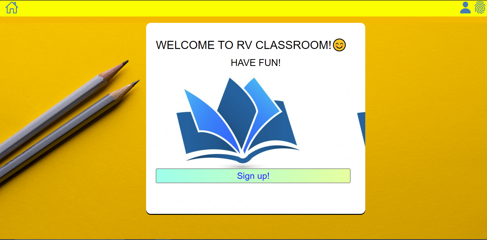

> For new user please click the  **SIGN UP!** button and procced as mentioned in [CREATING ACCOUNT](#createaccount).

 

> If existing user please opt **LOGIN** button also displayed as fingerprint icon and futher procced as mentioned in [LOGIN](#login).
 
 
 
<h2 id='createaccount'> CREATE ACCOUNT </H2>

On navigating through signup/account creation page 
 
 

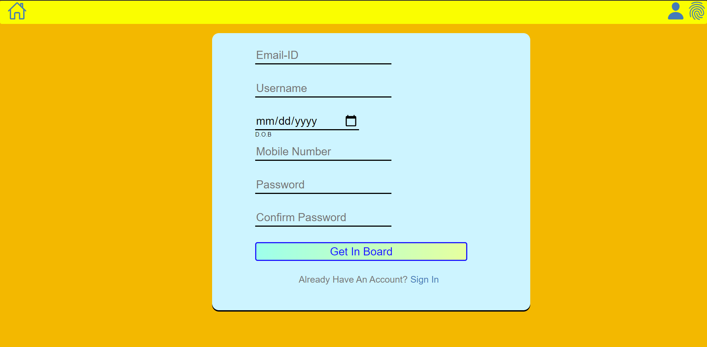

 

>- Please enter user details and create a password to create user account 
>- Then click **GET IN BOARD** button to create user account

Further user will be navigated to [LOGIN](#login) page.
 
 

<h2 id='login'> LOGIN </h2>
 

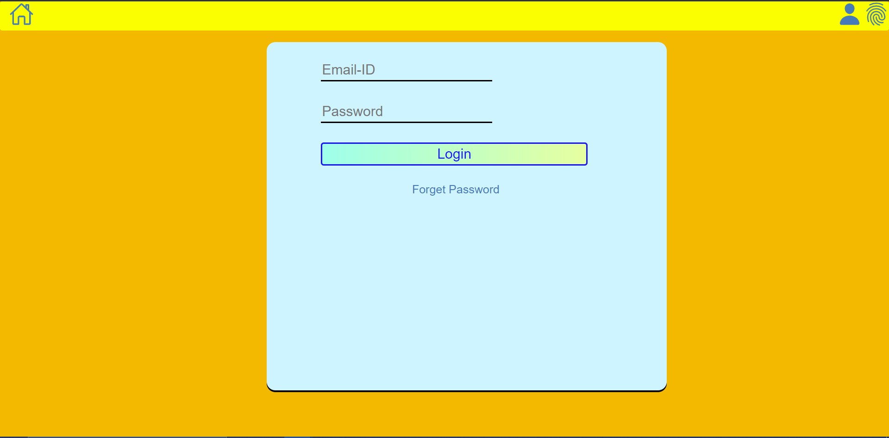

> - Enter user credentials here and click **LOGIN**
> - Incase if user forgot user credentials click [FORGET PASSWORD](#forgetpassword) link to reset user password

After logging in user will be navigated to [DASHBOARD](#dashboard) page

 

<h2 id='dashboard'> DASHBOARD </h2>

 

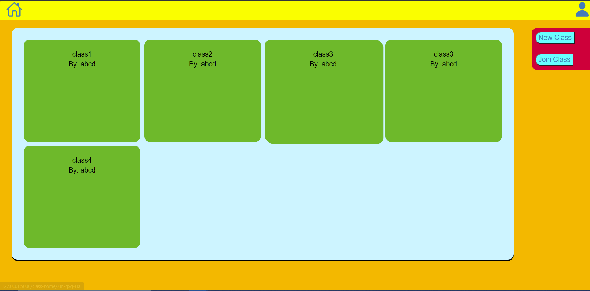

The Dashboard will display all the classes that user has been enrolled 
  

> - Hover over the class name of each class to further navigate to through the class user will be navigated to [CLASS DETAILS](#classdetails)  
> - The **NEW CLASS** on the top right corner will help in creating new classes as the user with the class administrator/teacher privileges.  
> - The **JOIN CLASS** will help in enrolling the user to a class with *class-id*.  
 
 

The navigation bar on the top will be helpful to navigate through pages such as 
> - The top right corner **HOME ICON** will lead the user to [DASHBOARD](#dashboard)   
> - The **CONTACT ICON** on the right will help us in navigating to [ACCOUNT DETAILS](#accountdetails) and **LOGOUT** functionality.   

 
 

<h2 id='classdetails'> CLASS DETAILS </h2>
  

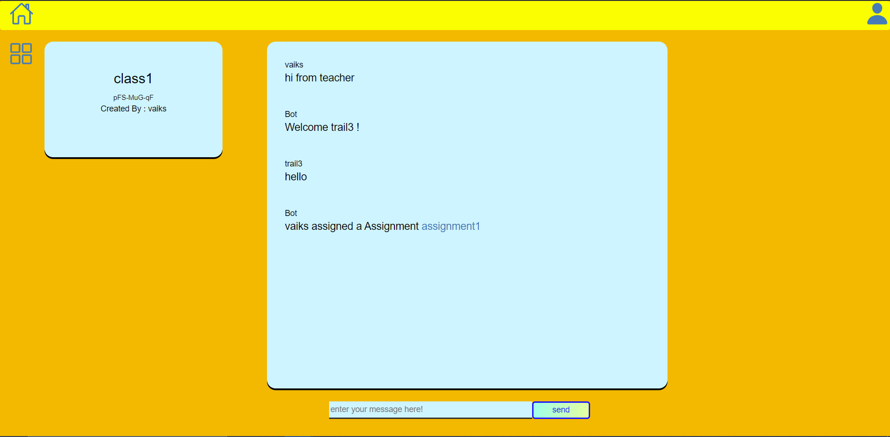

 

> - Communication between teacher students can be done here   
> - Class details are being displayed towards the right of the chat   
> - The **MENU/SQUARE ICON** will help in navigating between classchat and assignment submission(if user is with teacher privileges assign assignment option is available )   

 
 

<h2 id='assignment'> ASSIGNMENT </h2>
  

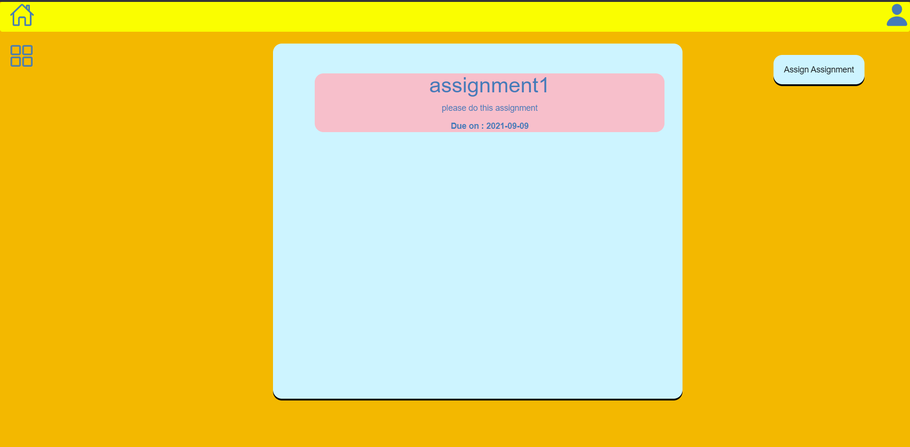

 
 

> - In this section assignment being assigned or created(if user with teacher privileges) are displayed for the corresponding class   
> - On clicking the assignment user will be navigated to assignment submission section    

 
If user with student privilege

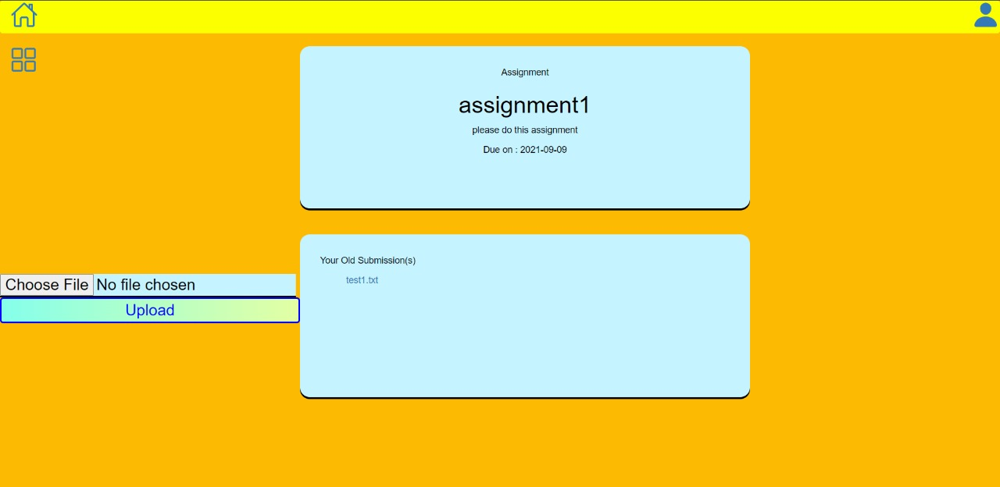

 
 

If user with Teacher privilege

- Assignment can be assigned
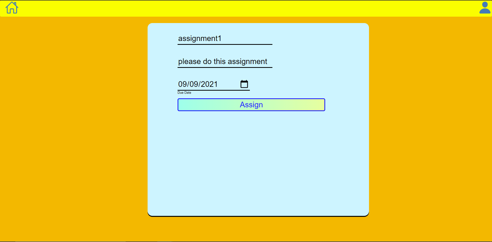
 
 

- Assignment of submitted students can be viewed
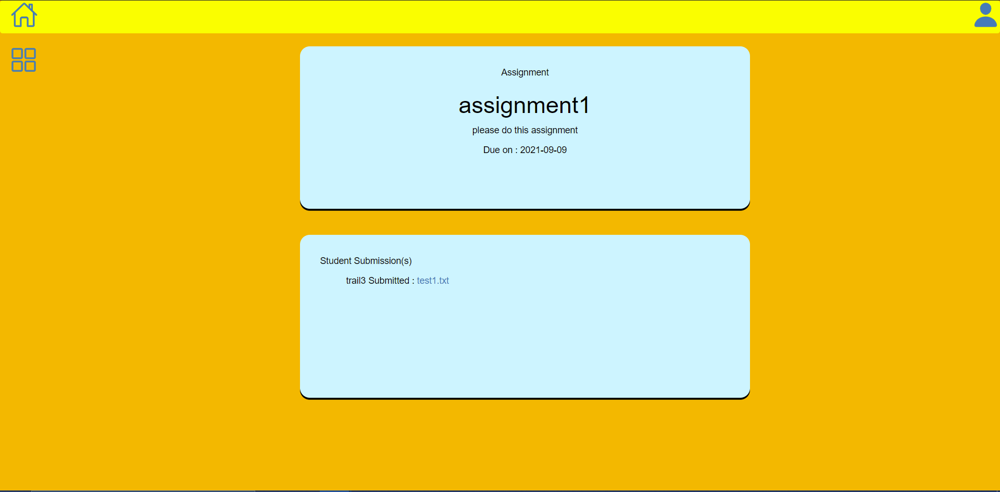

- > - Clicking the file name will download the assignment to the local system.

 
 

<h2 id='accountdetails'> ACCOUNT DETAILS </h2>
  

In the accounts details section user can preview list of classes enrolled and user details with default user display picture

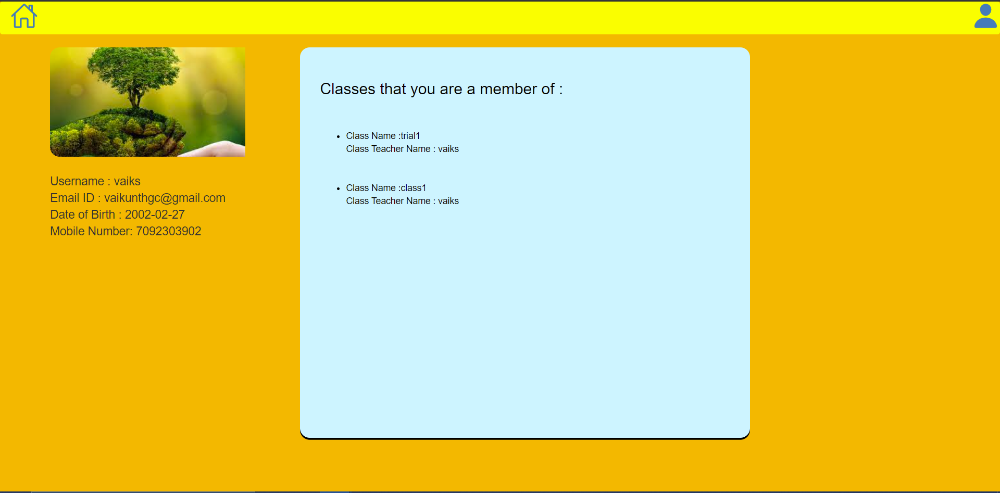

 
 

<h2 id='forgetpassword'> FORGET PASSWORD </h2>
  

In this page user can enter their registered email-id to receive reset password link 

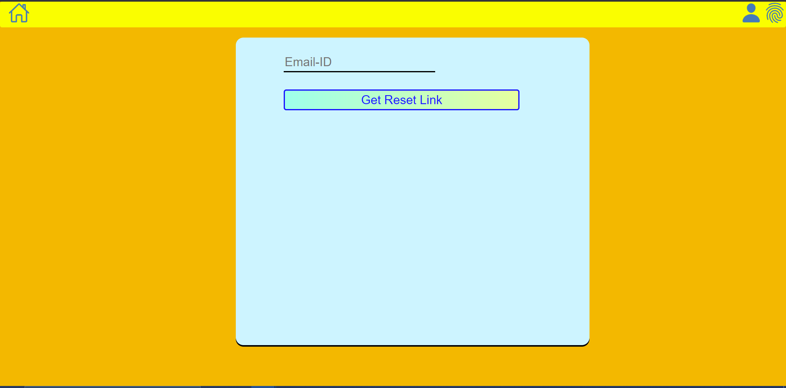

# Author
- Vaikunth Guruswamy
- R.V.Rohinth Ram
